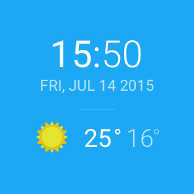
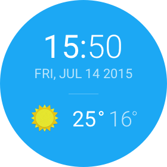
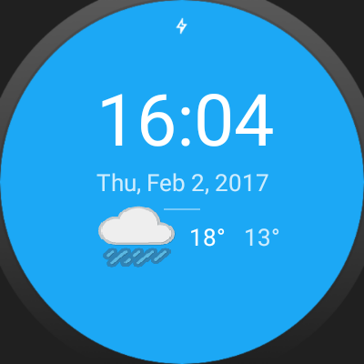

# Sunshine for Wear

This is the repository for the weather app that students build during the [Developing Android Apps](https://www.udacity.com/course/new-android-fundamentals--ud851) course at Udacity. It extends it using Android Wear.

## Required Behavior

* [x] App works on both round and square face watches.

* [x] App displays the current time.

* [x] App displays the high and low temperatures.

* [x] App displays a graphic that summarizes the day’s weather (e.g., a sunny image, rainy image, cloudy image, etc.).

* [x] Watch face obtains weather data by talking with a copy of Sunshine running on a device paired to the watch.

* [x] App conforms to common standards found in the [Android Nanodegree General Project Guidelines](http://udacity.github.io/android-nanodegree-guidelines/core.html).

*Example of a square watchface*

*Example of a round watchface*

*Final watchface*

## Tips for connecting to emulator

* Create an Android Wear AVD in Android studio and run it

* Install the Android Wear app from Google Play on a physical device and plug it into your machine via USB

* Forward the AVD's communication port to the connected phone (you must do this every time the phone is connected): `adb -d forward tcp:5601 tcp:5601`

* Start the Android Wear app on your phone and connect to the emulator.

For more detailed information, see [this link](https://developer.android.com/training/wearables/apps/creating.html).